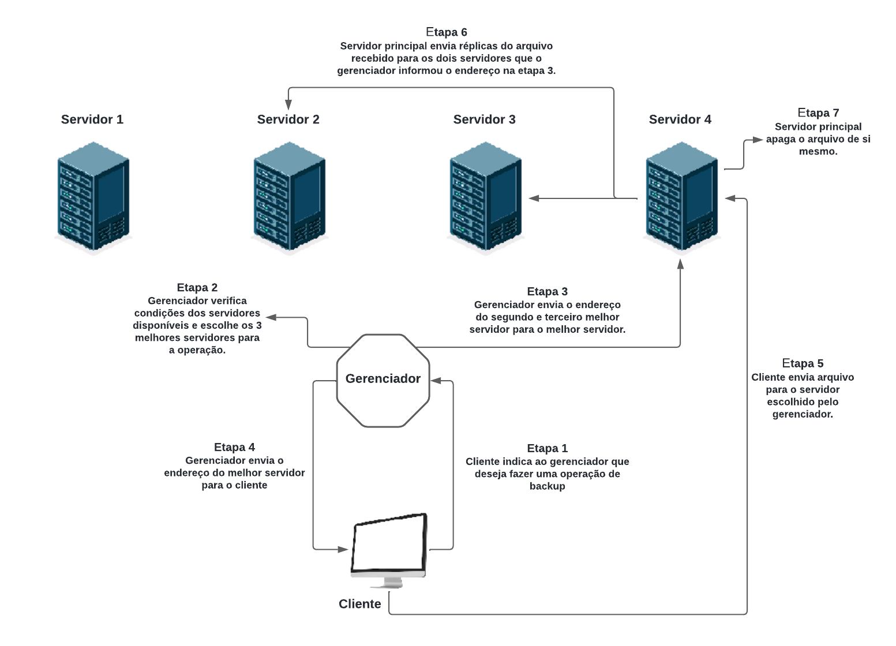
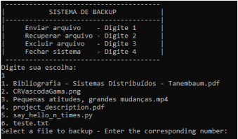

# Sistema de Backup Distribuído

> Status: em andamento

## _índice_

- <a href="#resumo">Resumo do projeto</a>
- <a href="#tecnologias-utilizadas">Tecnologias utilizadas</a>
- <a href="#componentes-sistema">Componentes do sistema de backup</a>
- <a href="#politica">Política de desenvolvimento</a>
- <a href="#algoritmo-escolha">Algoritmo de escolha dos servidores</a>
- <a href="#comunicacao-componentes">Comunicação entre os componentes</a>

## _Resumo do projeto_

Este repositório contém todos os códigos utilizados no desenvolvimento de um sistema de backup distribuído, produzido como projeto da disciplina _*Sistemas Distribuídos*_ do curso de _*Ciência da Computação*_ da UFABC. O sistema construído permite a realização de backups de arquivos por meio de um cliente, que envia o arquivo para um servidor escolhido por um gerenciador. O sistema suporta a replicação de arquivos em outros servidores, garantindo a disponibilidade e redundância dos dados. Na sequência desse documento são descritos os detalhes de implementação e funcionamento desse sistema de backup.

## _Tecnologias utilizadas_

Todos os códigos foram desenvolvidos em python, com a utilização da biblioteca [socket](https://docs.python.org/3/library/socket.html). Não foi permitida a utilização de nenhuma biblioteca que já possuía a implementação do que foi pedido. O projeto deveria ser implementado por meio da comunicação via sockets. Mais restrições e premissas do projeto podem ser lidas [aqui!](https://github.com/LeonardoMaioli/distributed_systems_file_backup/blob/main/project_description.pdf) Acessando o diretório [training_programming_sockets](https://github.com/LeonardoMaioli/distributed_systems_file_backup/tree/main/training_programming_sockets) desse repositório, é possível observar exemplos iniciais para treinamento de programação com sockets.

Os códigos foram desenvolvidos no Visual Studio Code e testados em ambientes Windows e Linux.

## _Componentes do sistema de backup_

O sistema de backup implementado é constituído de 1 cliente, 1 gerenciador e 4 servidores. Apesar disso, com simples mudanças, o sistema também funciona para um número maior de
servidores e pode ser adaptado para receber e controlar mais clientes. Segue a descrição de cada um desses componentes.

* __Cliente__

  O cliente é o responsável por iniciar o processo de backup, escolhendo qual atividade do sistema ele deseja realizar e, se necessário, enviando arquivos para o sistema. No 
  diretório do cliente, encontra-se o código em python do cliente e um diretório chamado files que contém todos os arquivos que o cliente possui e pode vir a enviar para o sistema de       backup.

* __Gerenciador__

  O gerenciador é quem centraliza a lógica do sistema, escolhendo os servidores para armazenamento dos arquivos e gerenciando a replicação. No diretório do gerenciador, encontra-se         apenas o código em python do gerenciador.

* __Servidores__

  Os servidores são os responsáveis pelo armazenamento dos arquivos enviados pelo cliente e replicação desses arquivos para outros servidores. No diretório de cada um dos servidores        estão localizados o código em python e um diretório chamado storage_files, inicialmente vazio, onde serão armazenados os arquivos que o servidor recebe.

 A seguinte árvore de diretórios facilita a visualização de como foi realizada a organização dos códigos e componentes:

 ```
├── backup_system
│   ├── client_1
│   │   ├── files
│   │   ├── client_1.py
│   ├── manager
│   │   ├── manager.py
│   ├── server_1
│   │   ├── storage_files
│   │   ├── server_1.py
│   ├── server_2
│   │   ├── storage_files
│   │   ├── server_2.py
│   ├── server_3
│   │   ├── storage_files
│   │   ├── server_3.py
│   ├── server_4
│   │   ├── storage_files
│   │   ├── server_4.py
└── 
```

## _Política de desenvolvimento_

Ao longo do desenvolvimento do sistema, foi priorizada a transparência de distribuição durante a comunicação entre os componentes. A presença do gerenciador neste sistema foi essencial para que essa política de transparência fosse alcançada. Isso porque, quando o cliente faz uma solicitação de envio de um arquivo para backup, é o gerenciador que escolhe e indica ao cliente qual o servidor que ele deve enviar o arquivo. Além disso, o gerenciador também informa a esse servidor escolhido os endereços de outros dois servidores, para que réplicas possam ser enviadas. Dessa forma, é escondido do cliente a localização do arquivo que ele enviou para backup, bem como que existe a replicação desse arquivo para outros servidores. Com isso, o
sistema consegue garantir as transparências de acesso, localização, migração e replicação.

Além da política de transparência, também foi pensado na escalabilidade do sistema. Por esse motivo, não foi implementada nenhuma operação de armazenamento ou envio de arquivos pelo gerenciador, deixando-o livre apenas para a tarefa de escolher os melhores servidores para o armazenamento de um arquivo do cliente, evitando uma possível sobrecarga desse componente com a adição de mais clientes no sistema, por exemplo.

## _Algoritmo de escolha dos servidores_

Como discutido na seção anterior, o gerenciador é responsável por escolher qual o melhor servidor para o cliente enviar o arquivo e, além disso, escolher outros dois servidores para que quando o primeiro receba o arquivo do cliente, ele possa enviar réplicas para esses outros dois e apagar o arquivo de si mesmo. Nesse sentido, foi implementado um algoritmo no código do gerenciador que cumpre com essas tarefas. Nesse algoritmo, o gerenciador verifica as latências e quantidade de bytes já armazenados em cada servidor disponível.

Com base nessas informações, o melhor servidor é escolhido sendo aquele que possui a menor latência e menor quantidade de bytes já armazenados. Essas métricas são ponderadas e cada uma, após uma normalização, tem peso de 50% na decisão. Dessa maneira, são selecionados 3 servidores, o primeiro irá receber o arquivo do cliente e enviar réplica do arquivo para os outros dois, apagando o arquivo de si mesmo após esse processo.

## _Comunicação entre os componentes_

Seguindo a política adotada para o desenvolvimento do sistema, a comunicação entre os componentes, durante o envio de um arquivo para backup por um cliente, ocorre nas seguintes etapas:

  1. Cliente indica ao gerenciador que deseja fazer uma operação de backup.
  2. Gerenciador verifica condições dos servidores disponíveis e escolhe os 3 melhores servidores para a operação.
  3. Gerenciador envia o endereço do segundo e terceiro melhor servidor para o melhor servidor.
  4. Gerenciador envia o endereço do melhor servidor para o cliente.
  5. Cliente envia arquivo para o servidor escolhido pelo gerenciador.
  6. Servidor principal envia réplicas do arquivo recebido para os dois servidores que o gerenciador informou o endereço na etapa 3.
  7. Servidor principal apaga o arquivo de si mesmo.

A Figura abaixo ilustra esse processo de comunicação que acontece no sistema:



## _Passo a passo para executar o sistema_

Como indicado na árvore de diretórios mostrada na seção Componentes do sistema de backup, o diretório [backup_system](https://github.com/LeonardoMaioli/distributed_systems_file_backup/tree/main/backup_system) possui todos os arquivos necessários para que qualquer pessoa possa executar o sistema em sua máquina.

Com base nesses arquivos, segue o passo a passo para a execução do sistema:

  1. Colocar em execução cada um dos 4 servidores para que todos possam receber e tratar requisições. Ou seja, rodar os códigos [server_1.py](https://github.com/LeonardoMaioli/distributed_systems_file_backup/blob/main/backup_system/server_1/server_1.py), [server_2.py](https://github.com/LeonardoMaioli/distributed_systems_file_backup/blob/main/backup_system/server_2/server_2.py), [server_3.py](https://github.com/LeonardoMaioli/distributed_systems_file_backup/blob/main/backup_system/server_3/server_3.py) e [server_4.py](https://github.com/LeonardoMaioli/distributed_systems_file_backup/blob/main/backup_system/server_4/server_4.py). Se menos de 4 forem colocados em execução, é necessário alterar o código do gerenciador que está previsto para trabalhar com no mínimo 4.
  2. Colocar em execução o gerenciador para que esse também possa receber e tratar requisições. Ou seja, rodar o código [manager.py](https://github.com/LeonardoMaioli/distributed_systems_file_backup/blob/main/backup_system/manager/manager.py).
  3. Colocar em execução o cliente para que ele possa enviar requisições. Ou seja, rodar o código [client_1.py](https://github.com/LeonardoMaioli/distributed_systems_file_backup/blob/main/backup_system/client_1/client_1.py).
  4. Com o cliente aberto, é mostrada a interface inicial em que é possível escolher a opção que o cliente deseja realizar. Para esse trabalho, apenas a opção 1 de enviar arquivos para backup foi desenvolvida. As demais estão em desenvolvimento.
  5. Com a opção 1 escolhida, a interface irá listar os arquivos que o cliente possui em seu diretório files e pedir para que o cliente escolha qual o arquivo que ele deseja enviar para o sistema de backup.
  6. Pronto! Com o arquivo escolhido, o sistema de backup já irá realizar todo o processo de comunicação explicado anteriormente, armazenando o arquivo enviado em dois servidores escolhidos pelo gerenciador. Quando o cliente encerrar o envio para o primeiro servidor, a interface inicial retornará à tela em 5 segundos, possibilitando um novo envio.

A figura abaixo mostra como a interface é apresentada nas etapas 4 e 5:




